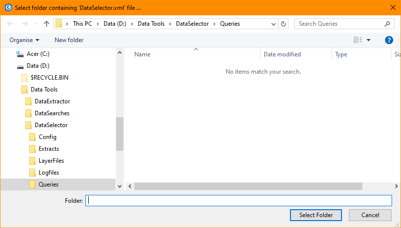
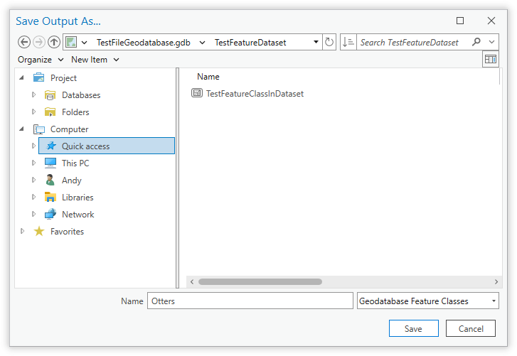

.. index::
	single: Running the tool

****************
Running the tool
****************

Instructions
------------

The operation of the Data Selector tool is explained in this section. While the interface is similar between the ArcGIS Pro, ArcMap and MapInfo implementations of the tool, there are some differences. This user guide is specific to the ArcGIS Pro version of the tool.

As discussed in the :doc:`Setting up the tool <../setup/setup>` section, the Data Selector tool is operated from the GIS application. It relies on the SQL tables containing any data that may be selected and a configuration document for setting up the tool. Therefore, before running the tool, ensure the following conditions are met:

- The XML configuration document has been set up correctly and is named correctly.
- The Data Selector tool has been installed and set up.

.. seealso::
	Please refer to the :doc:`setup <../setup/setup>` section for further information about any of these requirements.

.. raw:: latex

   \newpage

.. index::
	single: Opening the form

Opening the tool
================

To open the Data Selector tool in ArcGIS Pro, open the **Tools** menu bar and click on the **Data Selector tool** button (:numref:`figLaunch`).

.. _figLaunch:

	Launching the Data Selector tool in ArcGIS Pro

.. raw:: latex

   \newpage

.. index::
	single: Initial set-up

Initial set-up
==============

In order to function, the tool needs to know the location of the XML configuration files. The first time
the tool is run, or whenever the configuration file is moved, the user must specify the folder containing
the XML files.

Click on the 'Open folder' button.

.. _figOpenXMLFolderButton:

	Click on the Open Folder button

Then navigate to the folder containing the XML files and click OK. If the tool XML file is present and its
structure is correct, the list of user profiles will appear in the drop-down list.

.. _figSelectConfigFolder:

	Locating the configuration file folder

.. note::
	The location of the configuration folder will be stored for future use.

Loading a profile
=================

If more than one user XML profile is found, and the tool configuration file is configured to allow the user
to choose the XML profile, then the **Profile** tab will appear to allow the user to choose an XML profile.

.. _figSelectXMLProfile:

	Example warning message displayed for any XML structural issues

Select a profile and click 'Load' to start the tool using that profile. If there are any structural issues
with the selected XML profile, the tool will display a message with the error it has encountered, and not
load any further.

.. _figLaunchWarning:

	Example warning message displayed for any XML structural issues

Provided that the selected XML profile is otherwise correct, the **Select** tab will display 
(:numref:`figDisplayForm`).

.. _figDisplayform:

	The form displaying the available SQL tables and options

.. note::
	If there is only one user XML profile, or if the tool configuration file is configured to **not** allow
	the user to choose the XML profile, then the default XML profile will lead (if found).

.. raw:: latex

   \newpage

.. index::
	single: Using the form

Using the form
==============

Select the required source table in the **SQL Tables** box (:numref:`figSelectSQLTable`).

.. _figSelectSQLTable:

.. figure:: figures/SelectSQLTable.png
	:align: center

	Select the required source table in the SQL tables list

Select the output file format to contain the selected records (:numref:`figSelectOutputFormat`).

.. _figSelectOutputFormat:

	Select the output file format

The following options are available in ArcGIS Pro:

* **Geodatabase**
* **Shapefile**
* **Text file** (tab delimited)
* **CSV file** (comma delimited)

Finally, select whether the log file should be overwritten, and whether the log file should be opened upon completion. Now the form is set up to run your query.

.. raw:: latex

   \newpage

Entering queries
================

Specify the columns and SQL clauses that you wish to use to query the selected table. All syntax should adhere to SQL Server SQL syntax, and it is important that the correct part of the query is entered in the correct text box. Bear in mind when writing your query that the tool is designed to run a SELECT query only, and that it will not execute an action query (such as a delete, update or alter).

Select
	Enter the columns you wish to select in the ``Select`` box, including any changes in name (e.g. ``CommonName AS Name``)
From
	Select the table or view you wish to query
Where
	Enter any selection criteria in the ``Where`` box
Group By
	Enter any required grouping criteria in the ``Group By`` box

Order By
	Enter any required ordering criteria in the ``Order By`` box.

.. _figExample:

	Example of a simple query

.. note::
	It is not necessary to include key words such as ``SELECT``, ``WHERE``, ``GROUP BY`` and ``ORDER BY``. Doing so will make the query invalid.

A simple example query is shown in :numref:`figExample`.

.. _figExample:

	Example of a simple query

Choose the required output format.

.. _figSelectOutputFormat:

	Example of a simple query

.. note::
	If the required output format is a spatial dataset (i.e. Shapefile or Geodatabase feature class), but the output does not contain a spatial column, then the output format generated will be different than that specified. For shapefiles a .csv file will be generated, and for geodatabases a table will be generated.

.. raw:: latex

   \newpage

Running the query
=================

Once the correct query has been entered and the output format selected, check whether the log file should be overwritten using the ``Clear log file?`` check box and opened upon completion using the ``Open log file when run?`` check box. Then, click `OK`. You will be prompted for an output file (:numref:`figDefineOutput`). Enter a name for your output and click `Save`. If an existing file is selected, the tool will prompt you for permission to overwrite this, or to choose a different name. Once the output name has been selected the tool will begin the process.

.. _figDefineOutput:

	Enter the name for your output file.

While the process is running a progress bar will appear at the bottom of the form providing details of progress.

.. _figProgressBar:

.. figure:: figures/ProgressBar.png
	:align: center

	The progress bar as the process is running

Once the process has finished the log file will be opened (:numref:`figLogFile`), if required, so that you can check the process has completed correctly, and the results will be added to the screen as discussed above.

.. _figLogFile:

.. figure:: figures/LogFile.png
	:align: center

	The log file is shown when the process finishes

Depending on whether your query and selected output type generate a spatial or a tabular output, the output will be created and shown as follows:

Spatial
	If you are creating a **spatial** output layer, it may be split into point and polygon layers (as required) and will be added to the active map (or to a new map if no map is active) in a grouped layer.
Non-Spatial
	If you are creating a **non-spatial** output file it will be added to the active map (only if a map is active), otherwise the file will be created but not added to ArcGIS Pro.

An example of spatial and tabular outputs in ArcGIS Pro is shown in :numref:`figSpatialOutput` and :numref:`figTabularOutput`. 

.. _figSpatialOutput:

	Example output from a spatial query

Loading & saving queries
------------------------

Queries can be saved for future use, so once a query has been written and saved it can be loaded and re-run by any user at any time and it will output results from the most up-to-date copy of the database.

Queries can be saved or loaded by using the ``Save`` and ``Load`` buttons (:numref:`figSaveAndLoad`). They are saved as a simple text file with a '.qsf' file type.

.. _figSaveAndLoad:

	Save and load queries
