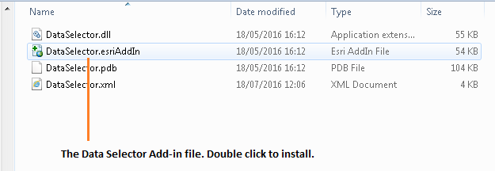
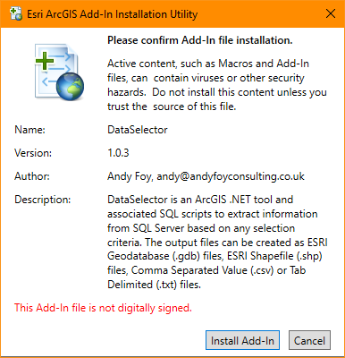
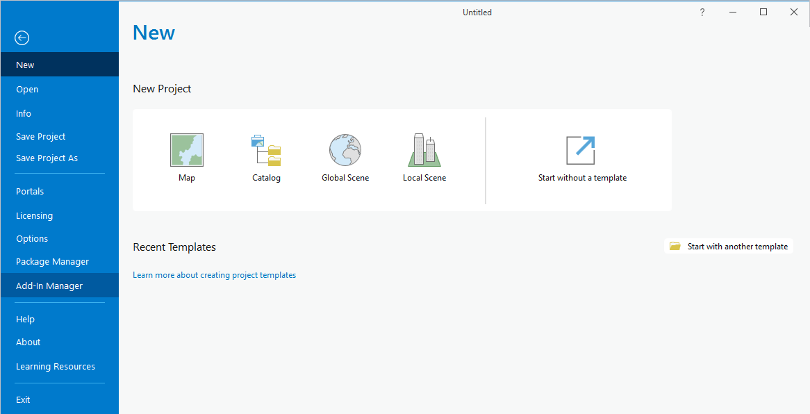
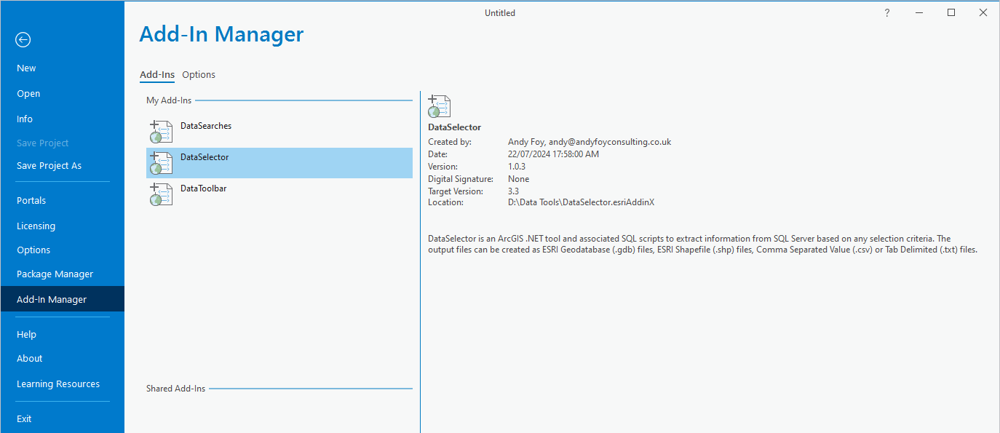

*******************
Setting up the tool
*******************

Before the Data Selector tool will function, it needs to be installed and configured. It is recommended that the configuration is carried out first, although the steps are interchangeable. 

.. index::
	single: Configuring the tool

Configuring the tool
====================

There are two configuration files used by the tool. They must be in the same folder.

Tool configuration file
-----------------------

This configuration file must be named 'DataSelector.xml' and it must be present for the tool to load. It allows the user to control which configuration file to load, and contains just three settings:

ChooseXML
	Is the user allowed to choose their own configuration file? (Yes/No)

DefaultProfile
	What the default XML file called is called. If blank, the tool looks for DefaultProfile.xml.

HelpURL
	The URL of the online user guide (this guide).

.. caution:: 
	The name of this configuration file must be 'DataSelector.xml'. The tool will not load if the file is not found.

User configuration profiles
---------------------------

These configuration files must be in the same folder as the tool configuration file. There can be as many profiles as you wish, each with different options and default settings. Each file contains all of the user options and default settings for the tool including, where files are kept, which SQL Server to connect to, which SQL Server tables to make available and other general settings. Attributes and settings are presented as nodes (beginning with a start node, e.g. ``<example>``, and finishing with an end note, e.g. ``<\example>``), with the value for the setting held between the ``<value>`` and ``<\value>`` tag. 

.. note::
	The XML profiles can have any name prefix as long as they have a '.xml' file extension.

The XML file can be edited in a text editor such as Notepad.

.. caution::
	It is important that the structure of the file is maintained as it is presented in the :doc:`Appendix <../appendix/appendix>`. Any changes to the structure may result in the Data Selector tool not loading, or not working as expected.

Once editing has been completed and the edits have been saved, it is recommended that the configuration file is opened using an internet browser such as Edge which will help highlight any editing errors – only if the structure of the file is valid will the whole file be displayed in the internet browser.

.. note::
	It is recommended that the configuration file is kept in a central (network) location, so that all users use the same configuration.

Details on the required attributes in this file are given below. This version of the configuration details is valid for the ArcGIS Pro version of the Data Selector tool.

LogFilePath
	The existing file location where log files will be saved with output messages.

SDEFile
	The location of the SDE file that specifies which SQL Server database to connect to.

SelectStoredProcedure
	The stored procedure to execute selection in SQL Server.

ClearStoredProcedure
	The stored procedure to clear selection in SQL Server.

DefaultExtractPath
	The existing file location where extracts will be saved by default. This can be overridden by the user when executing the tool.

DefaultQueryPath
	The existing file location where queries will be saved and loaded by default. This can be overridden by the user when executing the tool.

DefaultFormat
	The default format of the output files to be created. Options available are 'Geodatabase', 'Shapefile', 'CSV file' and 'Text file'.

DatabaseSchema
	The schema in the SQL Server database containing the source SQL tables. This is typically 'dbo'.

IncludeWildcard
	The **Include** wildcard for table names to list all the tables in SQL Server that can be selected by the user.

ExcludeWildcard
	The **Exclude** wildcard for table names in SQL Server that should **NOT** be available for selection by the user. This enables temporary and user-specific tables to be hidden in the tool interface.

DefaultSetSymbology
	Currently not used but must exist in XML.

LayerLocation
	Currently not used but must exist in XML.

DefaultClearLogFile
	The default for whether an existing log file should be cleared by default.

DefaultOpenLogFile
	The default for whether log file should be opened by default.

ValidateSQL
	Whether to validate the SQL before running. The SQL query can also be validated manually by clicking the 'Verify' button.

SQLTimeout
	The timeout in seconds for the SQL verify.

LoadColumnsVertically
	Whether to load the columns for the selected table as a vertical list with one column on each line. The alternative is a horizontal list with the columns just comma separated.

.. caution::
	All entries in the configuration file are **case sensitive**. Most common errors in the setting up of the tool are caused by using the incorrect case for entries.

.. index::
	single: Special characters in XML

.. raw:: latex

   \newpage

Special characters in XML
-------------------------

The characters ``&``, ``<`` and ``>`` are not valid within values and, so in order to be used, must be **escaped** with XML entities as follows:

<
	This must be escaped with ``&lt;`` entity, since it is assumed to be the beginning of a tag. For example, ``RecYear &lt; 2010``

>
	This should be escaped with ``&gt;`` entity. It is not mandatory -- it depends on the context -- but it is strongly advised to escape it. For example, ``RecYear &gt; 1980``

&
	This must be escaped with ``&amp;`` entity, since it is assumed to be the beginning of a entity reference. For example, ``TaxonGroup = 'Invertebrates - Dragonflies &amp; Damselflies'``

.. raw:: latex

   \newpage

.. index::
	single: Setting up the SQL database

Setting up the SQL Server database
==================================

In addition to any SQL tables containing records to be extracted using the Data Selector tool, an auxiliary table must also be present in the SQL Server database in order for the tool to be able to select data from tables held in SQL Server. This table is as follows:

_`Spatial_Tables` table
	This table contains information about any SQL spatial tables or views that may be used by the tool. The table has the following columns:

	.. tabularcolumns:: |L|L|

	.. table:: Valid date and time format specifiers

		+-----------------+-----------------------------------------------------------------------------------------------+
		|      Column     |                                          Description                                          |
		+=================+===============================================================================================+
		| TableName       | The name of the data table or view                                                            |
		+-----------------+-----------------------------------------------------------------------------------------------+
		| OwnerName       | The database owner, usually ``dbo``                                                           |
		+-----------------+-----------------------------------------------------------------------------------------------+
		| XColumn         | The name of the column holding the X coordinates of the record                                |
		+-----------------+-----------------------------------------------------------------------------------------------+
		| YColumn         | The name of the column holding the Y coordinates of the record                                |
		+-----------------+-----------------------------------------------------------------------------------------------+
		| SizeColumn      | The name of the column holding the grid size of the record (in metres)                        |
		+-----------------+-----------------------------------------------------------------------------------------------+
		| IsSpatial       | Bitwise column (1 = Yes, 0 = No) defining whether the table is spatially enabled              |
		+-----------------+-----------------------------------------------------------------------------------------------+
		| SpatialColumn   | If the table is spatially enabled, the name of the geometry column (e.g. ``SP_GEOMETRY``)     |
		+-----------------+-----------------------------------------------------------------------------------------------+
		| SRID            | The name of the spatial reference system used to plot the records                             |
		+-----------------+-----------------------------------------------------------------------------------------------+
		| CoordSystem     | The coordinate system of the spatial data in the table                                        |
		+-----------------+-----------------------------------------------------------------------------------------------+
		| SurveyKeyColumn | The column containing the survey key for each record                                          |
		+-----------------+-----------------------------------------------------------------------------------------------+

	.. note::
		The British National Grid `SRID` value is
		``Earth Projection 8, 79, "m", -2, 49, 0.9996012717, 400000, -100000 Bounds
		(-7845061.1011, -15524202.1641) (8645061.1011, 4470074.53373)``

	.. caution::
		This table must be filled out correctly for each SQL table or view that is available to the Data Selector tool.

	.. note::
		A number of stored procedures that are used by the tool for selecting the required records must also be present in the SQL Server database. To obtain copies of these procedures please contact `Andy Foy <mailto:andy@andyfoyconsulting.co.uk>`_.

.. raw:: latex

   \newpage

.. index::
	single: Installation

Installing the tool
===================

Installing the tool in ArcGIS Pro is straightforward. There are two ways it can be installed:

.. note::
	Before installing the tool you will need to install another ArcGIS Pro add-in 'DataToolbar'. This add-in with simply create a new 'Tools' toolbar onto which the Data Selector tool and other Data tools will be added once installed. To install the toolbar follow the instructions below using  the DataToolbar add-in.

Installation through Windows Explorer
-------------------------------------

Open Windows Explorer and double-click on the ESRI Add-in file for the Data Selector tool (:numref:`figInstallTool`).

.. _figInstallTool:

	Installing the Data Selector tool from Windows Explorer

.. raw:: latex

   \newpage

Installation will begin after confirming you wish to install the tool on the dialog that appears (:numref:`figConfirmInstall`).

.. _figConfirmInstall:

	Installation begins after clicking 'Install Add-in'

Once it is installed, it will appear in the Add-In Manager and on the 'Tools' menu bar.

.. note::
	The 'Tools' menu bar will only appear once the DataToolbar add-in has also been installed.

.. caution::
	In order for this process to work all running ArcGIS Pro sessions must be closed. The tool will not install or install incorrectly if there are copies of ArcGIS Pro running.

.. raw:: latex

   \newpage

Installation from within ArcGIS Pro
-----------------------------------

Firstly, open ArcGIS Pro and go to the Add-In Manager through the Project menu (:numref:`figOpenAddInManager`).

.. _figOpenAddInManager:

	Starting the ArcGIS Add-In Manager

.. raw:: latex

   \newpage

If the Data Selector tool is not shown, use the **Options** tab to add the folder where the tool is kept (:numref:`figAddInOptions`). The security options should be set to the lowest setting as the tool is not digitally signed.

.. _figAddInOptions:

.. figure:: figures/AddInOptions.png
	:align: center

	The 'Options' tab in the ArcGIS Pro Add-In Manager

.. note::
	Adding a network folder in the options tab will mean that all ArcGIS Pro add-ins in that folder, and all sub-folders, will be loaded when ArcGIS Pro starts.

After restarting ArcGIS Pro the tool will show in the Add-In Manager (:numref:`figAddInManager`) and on the 'Tools' menu bar.

.. _figAddInManager:

	The ArcGIS Pro Add-In Manager showing the Data Selector tool

.. note::
	The 'Tools' menu bar will only appear once the DataToolbar add-in has also been installed.
